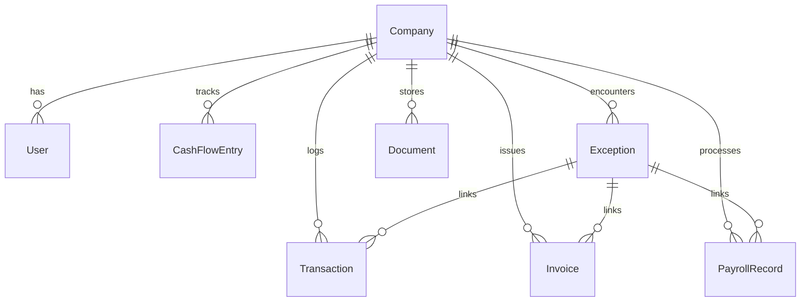

# FINOVA Project Progress Audit & Technical Handover Report

> **Target Audience**: AI models (GPT, Claude, Gemini), Engineering Leads, and Product Contributors.  
> **Repository**: `Taksh254/Finova-`  
> **Active Branch**: `Taksh` (up to date with `origin/Taksh`)  
> **Audit Date**: September 6, 2026  
> **Application Type**: Autonomous AI-Powered Finance Operations & AI CFO Platform (Next.js 15 App Router)

---

## 1. Executive Summary

**FINOVA** is an autonomous financial operations platform and AI CFO designed for high-growth tech companies and finance controllers (configured specifically for the Indian B2B market with INR `₹`, Lakhs/Crores notation, GST compliance, and April-March Indian fiscal year conventions).

The system architecture is structured around the closed-loop autonomous cycle:
$$\text{OBSERVE} \longrightarrow \text{UNDERSTAND} \longrightarrow \text{DECIDE} \longrightarrow \text{ACT} \longrightarrow \text{REVIEW}$$

### Key Value Propositions
1. **Autonomous Intelligence**: 5 background AI agents operating continuously on bank feeds, spend patterns, invoices, and compliance.
2. **Unified Financial Operating System**: Replaces fragmented spreadsheets, accounting software, and banking portals with a single command center.
3. **Bespoke Financial Design System**: Tailored Warm Cream (`#F7F3E8`, `#FCFAF4`) and Royal Blue (`#1D3B8F`, `#142A68`) aesthetics built with pure CSS Modules.

---

## 2. Git & Branch Status

- **Current Active Branch**: `Taksh`
- **Remote Tracking**: `origin/Taksh` (Clean working tree, fully synced)
- **Recent Git History**:
  - `2517a3f` — `chore: merge remote Taksh branch`
  - `c95a03c` — `docs: add comprehensive Finova platform documentation`
  - `2ebaff9` — `feat: complete Finova finance operations platform and cream-royal blue frontend redesign` (9,344 additions across 76 files)
  - `29effca` — `Initial commit from Create Next App`
  - `b04f089` — `Initial commit`

---

## 3. Technology Stack & Environment

| Layer | Technologies & Versions | Notes |
| :--- | :--- | :--- |
| **Framework** | Next.js `15.2.0` (App Router), React `19.0.0`, React DOM `19.0.0` | Node 18+ / 20+ / 22+ compatible |
| **Language** | TypeScript `5.x` | Strict typechecking enabled in `tsconfig.json` |
| **Database & ORM**| Prisma `6.4.1` with SQLite (`prisma/dev.db`) | Portable local DB for development/hackathon MVP |
| **Data Visualization** | Recharts `2.15.1` | Custom gradients, interactive tooltips, SVG sparklines |
| **Iconography** | Lucide React `1.16.0` | Enterprise UI icons |
| **Styling** | Vanilla CSS Modules (`*.module.css`) + CSS Variables in `globals.css` | No Tailwind dependency; bespoke cream/royal blue theme |
| **Scripting / Seed** | `tsx` `4.19.3` | Used for `npm run db:seed` |

---

## 4. Database Architecture (Prisma Schema - 8 Models)

Located at `prisma/schema.prisma` with existing SQLite database `prisma/dev.db` (90 KB, pre-seeded for demo entity **Arcova Technologies Pvt. Ltd.**):



### Models Summary
1. **`Company`**: Workspace tenant configuration (`displayName`, `currency = "INR"`, `fiscalYearStart = 4`, `industry`).
2. **`User`**: Team members and roles (`CFO`, `CONTROLLER`, `ANALYST`, `ADMIN`).
3. **`Transaction`**: Double-entry ledger entries (`REVENUE`, `EXPENSE`, `TRANSFER`, category, subCategory, amount, status: `CLEARED`, `PENDING`, `FLAGGED`, optional `exceptionId`).
4. **`Invoice`**: Accounts receivable and payable pipeline (`invoiceNumber`, `type: RECEIVABLE | PAYABLE`, `vendorClient`, `amount`, `issueDate`, `dueDate`, `status: PENDING | PAID | OVERDUE | EXCEPTION`).
5. **`PayrollRecord`**: Monthly payroll summaries (`period`, `totalAmount`, `headcount`, `exceptions` count, `status`).
6. **`CashFlowEntry`**: Daily/monthly running balance and flows (`date`, `period`, `inflow`, `outflow`, `netFlow`, `balance`).
7. **`Exception`**: Flagged anomalies (`type: RECONCILIATION | INVOICE | PAYROLL | FRAUD_ALERT | POLICY_BREACH`, `severity: LOW | MEDIUM | HIGH | CRITICAL`, `status: OPEN | IN_REVIEW | RESOLVED | DISMISSED`).
8. **`Document`**: RAG and policy storage (`name`, `type: POLICY | CONTRACT | REPORT | RECEIPT | OTHER`, `content`, `metadata`).

---

## 5. Current Implementation Status Matrix

### A. Routes & Pages (`app/(dashboard)/`)

| Route | File Path | Status | Details |
| :--- | :--- | :--- | :--- |
| `/` | `app/page.tsx` | **Completed** | Auto-redirects to `/overview`. |
| `/overview` | `app/(dashboard)/overview/page.tsx` | **Completed** | Full SSR page calling `getDashboardMetrics()` & `getCashFlowChartData()`, rendering client interactive dashboard. |
| `/exceptions` | `app/(dashboard)/exceptions/page.tsx` | **Completed** | Dynamic Server Component querying Prisma `exception.findMany()`, status count pills, severity badges, full table. |
| `/ai-agents` | `app/(dashboard)/ai-agents/page.tsx` | **Completed** | Standalone page hosting `AgentOrchestrator` and `AICFOCommandCard`. |
| `/transactions` | `app/(dashboard)/transactions/page.tsx` | **Placeholder** | Uses `ModulePlaceholder` with defined roadmap & schema mapping. |
| `/invoices` | `app/(dashboard)/invoices/page.tsx` | **Placeholder** | Uses `ModulePlaceholder` with planned OCR and Dunning roadmap. |
| `/expenses` | `app/(dashboard)/expenses/page.tsx` | **Placeholder** | Uses `ModulePlaceholder` for spend management. |
| `/cash-flow` | `app/(dashboard)/cash-flow/page.tsx` | **Placeholder** | Uses `ModulePlaceholder` for 13-week forecast dynamics. |
| `/accounts` | `app/(dashboard)/accounts/page.tsx` | **Placeholder** | Uses `ModulePlaceholder` for multi-bank aggregation. |
| `/reconciliation` | `app/(dashboard)/reconciliation/page.tsx` | **Placeholder** | Uses `ModulePlaceholder` for ledger vs bank matching. |
| `/reports` | `app/(dashboard)/reports/page.tsx` | **Placeholder** | Uses `ModulePlaceholder` for audit vault & tax filings. |
| `/payroll` | `app/(dashboard)/payroll/page.tsx` | **Placeholder** | Uses `ModulePlaceholder` for salary runs & anomaly checks. |
| `/treasury` | `app/(dashboard)/treasury/page.tsx` | **Placeholder** | Uses `ModulePlaceholder` for liquidity buffers & yields. |
| `/settings` | `app/(dashboard)/settings/page.tsx` | **Placeholder** | Uses `ModulePlaceholder` for tenant configuration. |
| `/help` | `app/(dashboard)/help/page.tsx` | **Placeholder** | Uses `ModulePlaceholder`. |
| `/ai-cfo` | `app/(dashboard)/ai-cfo/page.tsx` | **Placeholder** | Uses `ModulePlaceholder` for RAG and scenario simulation. |

---

### B. Core UI Components (`components/`)

| Component | Path | Functional State | Notes |
| :--- | :--- | :--- | :--- |
| **`Sidebar`** | `components/shell/Sidebar.tsx` | **100% Functional** | Navigation grouped by Finance, Intelligence, Workspace. Dynamic route highlighting, active alert badges, status pill. |
| **`TopBar`** | `components/shell/TopBar.tsx` | **100% Functional** | Workspace search, company dropdown, fiscal date range filter, notification pill, quick action button. |
| **`ModulePlaceholder`** | `components/shell/ModulePlaceholder.tsx` | **100% Functional** | Standardized, elegant empty-state showing icon, planned features, and linked Prisma schema fields. |
| **`OverviewDashboardClient`** | `components/dashboard/OverviewDashboardClient.tsx` | **100% Functional** | Top-level client dashboard coordinator with modal triggers and floating toast notifications. |
| **`MetricCard`** | `components/dashboard/MetricCard.tsx` | **100% Functional** | Renders KPI card with label, value, comparison %, badge, and inline SVG sparklines. |
| **`CashFlowChart`** | `components/dashboard/CashFlowChart.tsx` | **Functional (Mock Visual)** | Timeframe toggles (`7D`, `30D`, `3M`, `6M`, `1Y`), Recharts dual-area + dashed line. Series currently mocked in-file for smooth curves. |
| **`AICFOCommandCard`** | `components/dashboard/AICFOCommandCard.tsx` | **100% Functional** | Orbital animated core, live alert items with severity colors, and one-click action triggers. |
| **`QuickActionsBar`** | `components/dashboard/QuickActionsBar.tsx` | **100% Functional** | 6 action buttons for invoice generation, expense recording, bank sync, reconciliation batch, reports, and AI chat. |
| **`RecentTransactions`** | `components/dashboard/RecentTransactions.tsx` | **Functional (Mock Feed)** | Ledger table with category badges, account tags, credit/debit formatting. Uses internal sample array. |
| **`OutstandingInvoicesCard`** | `components/dashboard/OutstandingInvoicesCard.tsx` | **Functional (Mock Segments)**| Displays AR total, 3-segment aging bar (Overdue, Due this week, Due later), and legend breakdown. |
| **`FinancialHealthCard`** | `components/dashboard/FinancialHealthCard.tsx` | **100% Functional** | SVG radial score gauge (86/100 Healthy) with 4 horizontal sub-metric progress bars. |
| **`AIInsightsRow`** | `components/dashboard/AIInsightsRow.tsx` | **100% Functional** | 3 actionable insight cards with category tags, impact metrics, and click listeners. |
| **`AgentOrchestrator`** | `components/dashboard/AgentOrchestrator.tsx` | **100% Functional** | Pipeline visual displaying the 5 autonomous agents, status badges, sync animation, and batch approval trigger. |
| **`FinancialModals`** | `components/dashboard/FinancialModals.tsx` | **100% Functional** | Modal popups: Create Invoice, Add Expense, and Interactive AI CFO Chat Assistant with conversational financial reasoning. |
| **`Toast`** | `components/dashboard/Toast.tsx` | **100% Functional** | Smooth floating pill banner acknowledging user actions. |

---

### C. Backend Calculations & AI Layer (`lib/`)

| File | Purpose & Architecture |
| :--- | :--- |
| **`lib/db/prisma.ts`** | Global PrismaClient singleton with hot-reload safety for Next.js development. |
| **`lib/finance/formatting.ts`** | INR currency formatting: `₹4.8L`, `₹1.2 Cr`, `₹42k`, percentage signs, date strings, relative time. |
| **`lib/finance/metrics.ts`** | Queries SQLite via Prisma for live MoM revenue, expenses, cash position, AR, AP, gross burn, and runway months. |
| **`lib/ai/types.ts`** | Strongly-typed interfaces for `FinancialBrief`, `FinancialObservation`, `RecommendedAction`, and `IAIFinancialService`. |
| **`lib/ai/financialAnalyzer.ts`** | `RuleBasedFinancialAnalyzer`: Computes revenue growth %, SaaS spend expansion %, upcoming payables in next 7 days, and generates actionable recommendations with app routing. |
| **`lib/ai/index.ts`** | Factory pattern (`getAIService()`) ready to swap between deterministic rule engines and real LLMs (OpenAI, Gemini, Anthropic). |

---

### D. REST API Endpoints (`app/api/`)

| Endpoint | Method | Response Payload |
| :--- | :--- | :--- |
| `/api/dashboard/overview` | `GET` | Aggregated financial metrics (Revenue, Expenses, Cash, AR, AP, Runway). |
| `/api/dashboard/cashflow` | `GET` | Historical cash flow time-series from `CashFlowEntry`. |
| `/api/dashboard/exceptions` | `GET` | List of items requiring immediate CFO / controller attention. |
| `/api/dashboard/activity` | `GET` | Audit log of recent finance events (invoices, reconciliation, payroll). |
| `/api/ai/brief` | `GET` | AI Financial Intelligence brief (health status, observations, recommendations). |

---

## 6. Known Gaps & Immediate Opportunities

1. **Local Dependencies**:
   - `node_modules` is not yet installed in this local environment. A fresh `npm install` is needed before running `npm run dev` or `npm run build`.
2. **Dynamic Data Binding in Secondary Widgets**:
   - `RecentTransactions.tsx` currently renders a static list of 5 transactions instead of calling `prisma.transaction.findMany()` or `/api/dashboard/activity`.
   - `CashFlowChart.tsx` currently visualizes a static 30-day series (`thirtyDaySeries`) instead of mapping the dynamic `data` prop passed from the server.
   - `OutstandingInvoicesCard.tsx` has static segmentation percentages (`33%`, `29%`, `38%`).
3. **Dedicated Pages Beyond Overview**:
   - The 11 placeholder pages (`/transactions`, `/invoices`, `/expenses`, `/cash-flow`, `/accounts`, `/reconciliation`, `/reports`, `/payroll`, `/treasury`, `/settings`, `/ai-cfo`) currently render `ModulePlaceholder`. The Prisma models and schemas are ready to power full data tables and workflows for these views.
4. **AI Engine Integration**:
   - `RuleBasedFinancialAnalyzer` is currently an algorithmic rule-based synthesizer. The `IAIFinancialService` interface is already built to plug in real LLM APIs (e.g., Gemini 1.5/2.0 or OpenAI GPT-4o) using prompt-driven synthesis over live financial data.

---

## 7. Recommended Next Steps for Continuation

1. **Environment Setup**:
   ```bash
   npm install
   npm run db:push
   npm run db:seed
   npm run dev
   ```
2. **Convert Secondary Dashboard Widgets to Live DB Feeds**:
   - Connect `RecentTransactions` directly to the `Transaction` table.
   - Map `cashFlowData` prop to the Recharts area plots in `CashFlowChart`.
3. **Build Out Primary Placeholder Modules**:
   - Priority 1: `/invoices` (List invoices with filter pills: Overdue, Pending, Paid; Add Invoice form).
   - Priority 2: `/transactions` (Searchable, filterable ledger with category tagging).
   - Priority 3: `/reconciliation` (Interactive reconciliation queue where users can match bank lines to ledger items).
4. **Live LLM Integration**:
   - Implement `LLMFinancialAnalyzer` in `lib/ai/` implementing `IAIFinancialService`, utilizing structured output for the AI brief and AI CFO chat modal.
